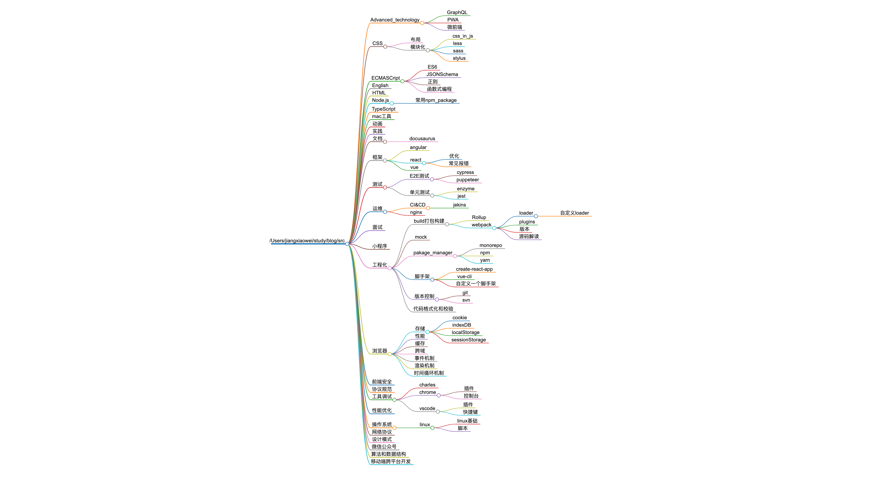

<!-- START doctoc generated TOC please keep comment here to allow auto update -->
<!-- DON'T EDIT THIS SECTION, INSTEAD RE-RUN doctoc TO UPDATE -->

- [blog](#blog)
  - [程序员三大美德](#%E7%A8%8B%E5%BA%8F%E5%91%98%E4%B8%89%E5%A4%A7%E7%BE%8E%E5%BE%B7)
  - [思维导图](#%E6%80%9D%E7%BB%B4%E5%AF%BC%E5%9B%BE)
  - [关于该 repo](#%E5%85%B3%E4%BA%8E%E8%AF%A5repo)
  - [参考](#%E5%8F%82%E8%80%83)

<!-- END doctoc generated TOC please keep comment here to allow auto update -->

# blog

## 程序员三大美德

- 急躁

  > 是这样一种愤怒----当你发现计算机懒洋洋地不给出结果。于是你写出更优秀的代码，能尽快真正的解决问题。至少看上去是这样。

- 懒惰

  > 是这样一种品质，它使得你花大力气去避免消耗过多的精力。它敦促你写出节省体力的程序，同时别人也能利用它们。为此你会写出完善的文档，以免别人问你太多问题。

- 傲慢

  > 极度的自信，使你有信心写出（或维护）别人挑不出毛病的程序。

## 思维导图

## 关于该 repo

1. 在 pre-commit 阶段

   1. `lint-staged`

      1. ~~`doctoc` 对新增的 md 文件自动添加针对 github 的目录~~

         目录交给 docusaurus 处理

      2. 有改动的 md 文件重新添加`frontmatter`

   2. `docs`文件自动生成`website/sidebars.js`文件

2. pre-push 阶段

   1. 判断文件夹是否包含空格

   2. 空文件夹子自动添加 TODO.md

      因为 git 无法追踪空文件夹

   3. 针对 src 下文件夹自动生成思维导图 xmind.html 和 xmind.png

      1. src 下目录内容会生成 hash 文件，在`.scriptc/.cache/xmind.cache`
      2. 根据 hash 判断是否需要重新生成 html 和 png
      3. 先扫描 src，生成 xmind.md
      4. `markmap-lib` 将 xmind.md 生成 html
      5. `puppeteer`对 html 截图生成 png

## 参考

1. [程序员三大美德](http://www.ruanyifeng.com/blog/2006/05/laziness_impatience_and_hubris.html)
